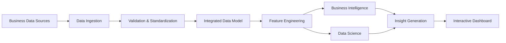
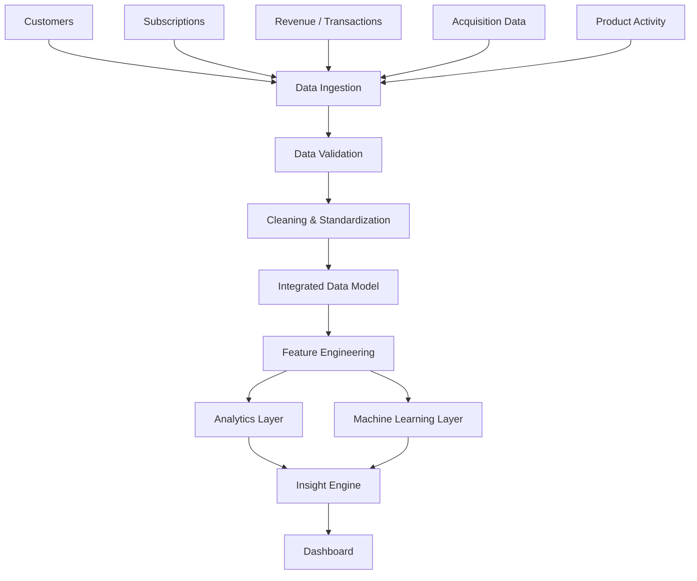
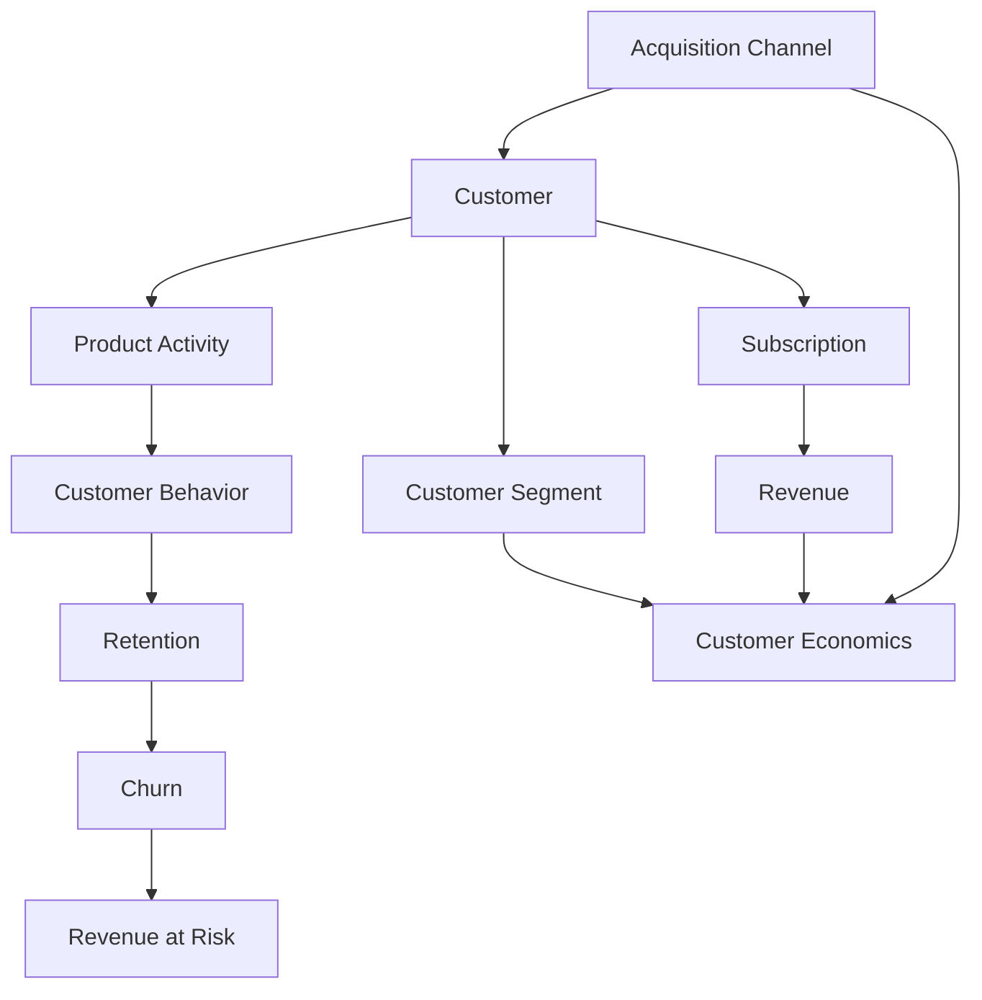

# RevLens | SaaS Revenue & Customer Dynamics

An academic portfolio project for analyzing SaaS business performance by connecting revenue, customer acquisition, retention, churn, customer behavior, and unit economics within a unified analytics workflow.

> Status: Planned / under development  
> Scope: Student project designed for a three-month development period

## Abstract

SaaS businesses generate interconnected data across customers, subscriptions, revenue, acquisition channels, product activity, and operating costs. Examining metrics such as recurring revenue, churn, customer acquisition cost, and retention independently can make it difficult to understand the relationships between customer behavior and business performance.

This project proposes RevLens, an integrated analytics and decision-support platform for analyzing SaaS revenue and customer dynamics. The planned system will ingest and standardize relevant business data, calculate SaaS-specific metrics, and analyze customer behavior across revenue, acquisition, retention, churn, and unit economics.

A data science layer will extend the analysis through customer segmentation, churn-risk prediction, revenue forecasting, and anomaly detection. RevLens will connect predictive customer risk with customer value, revenue exposure, behavioral context, and business priority to generate interpretable decision-support insights through an interactive Streamlit dashboard.

> Quantitative model-performance results will be documented after implementation and evaluation. No results are claimed at the planning stage.

## 1. Project Overview

SaaS businesses produce data from multiple operational areas. Revenue may change because of new customers, expansion, contraction, or churn, while customer economics can vary by acquisition channel, plan, cohort, and behavioral segment.

The project therefore treats RevLens as an interconnected analytical problem rather than a set of isolated dashboards.

### Problem Statement

SaaS businesses collect large amounts of information about customers, subscriptions, revenue, acquisition, product activity, and retention. Looking at these areas separately can make it difficult to understand which customers are at risk, how much revenue is affected, and which customer-related issues should be prioritized.

### Problem Gap

Existing SaaS analytics, customer-success, and revenue-intelligence systems already provide many of the individual capabilities used by RevLens, including revenue reporting, retention analysis, churn analytics, customer segmentation, forecasting, and customer-risk analysis. The project does not claim that these capabilities are individually novel.

The identified gap is the difficulty of connecting predictive customer intelligence to financially contextualized and prioritized decision support in one analytical workflow. A churn prediction or customer-risk score alone does not indicate which customers matter most financially, how much recurring revenue is exposed, or how customer behavior and segment characteristics should influence prioritization.

RevLens addresses this gap by connecting:

- Customer behavior and subscription characteristics
- Predictive customer risk
- Customer value and unit economics
- Revenue exposure
- Segment-level business context
- Interpretable, prioritized decision-support insights

The intended contribution is therefore an integrated analytical framework rather than a new machine-learning algorithm. The project will evaluate whether connecting these outputs produces more useful business interpretation than presenting predictive results independently.

### Existing System

Existing SaaS analytics systems provide capabilities such as revenue tracking, customer segmentation, retention and churn analysis, forecasting, and customer-risk identification. However, these outputs may be viewed as separate metrics or predictions, making it difficult to understand which customer risks have the greatest financial impact and should be prioritized.

### Proposed System

RevLens integrates revenue analytics, customer behavior, segmentation, predictive modelling, and unit economics into a unified workflow. It extends these capabilities by connecting customer risk with customer value, revenue exposure, behavioral context, and business priority to generate interpretable decision-support insights through an interactive Streamlit dashboard.

### Core analytical areas

1. SaaS Revenue Intelligence
2. Customer Acquisition and Retention
3. Churn Intelligence
4. Customer Intelligence
5. Unit Economics

The planned data science layer extends these areas with:

- Customer segmentation
- Churn-risk prediction
- Revenue forecasting
- Anomaly detection

## 2. Objectives

The project aims to:

- Integrate relevant SaaS business data into a consistent analytical structure.
- Standardize and validate incoming data before analysis.
- Calculate SaaS-specific business metrics.
- Analyze revenue movement and composition.
- Examine acquisition efficiency and customer retention.
- Identify historical churn patterns and customers at risk of churn.
- Develop customer-level behavioral features and segments.
- Evaluate unit economics across meaningful business dimensions.
- Connect predictive outputs to financial and customer metrics.
- Generate interpretable business insights from analytical results.
- Present the results through an interactive dashboard.

## 3. Planned Data Domains

The exact datasets and fields will be finalized during implementation. The planned analytical domains are:

| Domain | Intended analytical use |
|---|---|
| Customers | Customer profiles, cohorts, segments |
| Subscriptions | Plans, subscription state, tenure |
| Revenue / Transactions | Recurring revenue and revenue movement |
| Acquisition | Channel and customer acquisition analysis |
| Product Activity | Engagement and behavioral features |
| Business Expenses | Unit economics and contribution analysis |

The project documentation will be updated with the final schema once the data model is implemented.

## 4. System Workflow

The platform is planned as a layered analytical pipeline:



The system is intentionally organized so that data preparation, analytical logic, modelling, and presentation are separated.

## 5. Data Pipeline

The planned pipeline follows this sequence:



### Pipeline stages

#### 5.1 Data Ingestion

Collect and load the project datasets into the analytical workflow.

#### 5.2 Data Validation

Check the structure and validity of incoming data before it reaches downstream analysis.

#### 5.3 Cleaning and Standardization

Normalize fields, resolve data-quality issues, and prepare consistent records for integration.

#### 5.4 Integrated Data Model

Connect customers, subscriptions, revenue, acquisition, product activity, and other required business data through a consistent model.

#### 5.5 Feature Engineering

Create analytical variables required for SaaS metrics, customer behavior analysis, unit economics, and machine learning.

#### 5.6 Analytics Layer

Calculate business metrics and perform descriptive and diagnostic analysis.

#### 5.7 Machine Learning Layer

Apply the planned modelling techniques to appropriate engineered features.

#### 5.8 Insight Engine

Combine analytical and modelling outputs into interpretable business findings.

#### 5.9 Dashboard

Present the resulting metrics, analyses, model outputs, and insights through an interactive interface.

## 6. Analytical Model

The analytical model is designed around the relationship between customer behavior and business economics.



This model allows the project to examine questions such as:

- How does acquisition relate to customer retention?
- How does customer behavior relate to churn?
- How does churn affect recurring revenue?
- How do customer segments differ in economic value?
- How do acquisition and retention affect unit economics?

## 7. Business Intelligence Layer

### Revenue Intelligence

Planned analysis includes:

- Monthly Recurring Revenue (MRR)
- Annual Recurring Revenue (ARR)
- New revenue
- Expansion revenue
- Contraction revenue
- Churned revenue
- Revenue growth
- Revenue by plan
- Revenue by customer segment
- Revenue by acquisition channel

A central objective is to explain changes in recurring revenue rather than only display the resulting trend.

### Acquisition and Retention

Planned analysis includes:

- Customers acquired by channel
- Customer Acquisition Cost (CAC)
- Conversion analysis
- Customer cohorts
- Retention patterns
- Customer lifetime
- Acquisition-to-revenue efficiency

### Churn Intelligence

Planned analysis includes:

- Churn rate
- Churn by plan
- Churn by cohort
- Churn by acquisition channel
- Churn by customer segment
- Revenue lost through churn
- Churn-risk prediction
- Revenue at risk

### Customer Intelligence

Customer-level behavioral features are intended to include relevant measures derived from subscription, usage, revenue, and interaction data. These features will support customer segmentation and interpretation of behavioral patterns.

### Unit Economics

Planned measures include:

- Customer Acquisition Cost (CAC)
- Customer Lifetime Value (LTV)
- Average Revenue Per User (ARPU)
- Gross margin
- Contribution margin
- LTV:CAC
- Customer payback period
- Revenue per customer

Where appropriate, these measures will be analyzed by plan, customer segment, acquisition channel, region, and cohort.

## 8. Data Science and Modelling

The modelling stage is planned as an extension of the BI layer.

### 8.1 Customer Segmentation

The project will investigate customer segmentation using engineered behavioral and economic features.

Planned modelling approach:

```text
Customer Data
    ↓
Behavioral Features
    ↓
Feature Preparation
    ↓
Clustering
    ↓
Cluster Evaluation
    ↓
Cluster Interpretation
```

K-Means is planned as an initial clustering method. Other methods may be evaluated where justified by the data and project requirements.

Cluster quality will be evaluated using appropriate clustering measures and, importantly, interpretability of the resulting customer groups.

### 8.2 Churn Prediction

The planned churn workflow is:

```text
Customer History
    ↓
Behavioral & Subscription Features
    ↓
Model Training
    ↓
Churn Probability
    ↓
Customer Risk Analysis
    ↓
Revenue-at-Risk Analysis
```

The final classification model and evaluation metrics will be documented after the dataset, target definition, and modelling experiments have been finalized.

### 8.3 Revenue Forecasting

Revenue forecasting is planned as a secondary modelling component. Its purpose is to extend historical revenue analysis toward future-period estimation.

The final forecasting method and evaluation procedure will depend on the time-series structure and available observations.

### 8.4 Anomaly Detection

Anomaly detection is planned to identify unusual patterns such as:

- Revenue anomalies
- Unusual customer behavior
- Significant changes in relevant business metrics

The final detection method will be selected and evaluated during implementation.

## 9. Decision Support and Insight Generation

The decision-support layer is the primary implementation of the identified project gap. It will connect existing analytical and modelling outputs into financially contextualized and prioritized insights rather than presenting them independently.

The layer will not rely on an opaque automated recommendation system. Instead, it will use transparent analytical rules and calculated business measures so that each insight can be traced back to its underlying data and model outputs.

For relevant customer-risk cases, the decision-support layer will combine:

- Churn probability or risk classification
- Monthly or recurring revenue contribution
- Customer value measures such as LTV where available
- Customer segment
- Behavioral and subscription indicators
- Revenue at risk
- Relative business priority

The intended reasoning flow is:


```text
Metric / Model Output
        ↓
Change Identification
        ↓
Affected Segment / Dimension
        ↓
Behavioral or Business Context
        ↓
Financial Impact
        ↓
Interpretable Insight
```

Examples of the intended insight format include identifying where a revenue change occurred, which customer segment or acquisition channel was associated with the change, and how the change relates to retention or customer economics.

These examples describe the intended output format and are not claims about results currently observed in the project.

## 10. Streamlit Application and Dashboard Structure

Streamlit will be used as the primary application layer for RevLens. It will provide the interactive interface through which users explore analytical outputs, model results, financial impact, and decision-support insights.

Streamlit is intentionally treated as the presentation and interaction layer rather than as the location where core data processing or modelling logic is implemented. Data preparation, feature engineering, analytics, and model training will remain in the project pipeline so that the analytical workflow can be tested independently from the user interface.

The planned dashboard will organize the analytical outputs into focused sections:

```text
Executive Overview
├── Revenue Intelligence
├── Acquisition & Retention
├── Churn Intelligence
├── Customer Intelligence
├── Unit Economics
├── Forecasting
├── Anomaly Detection
└── Insights
```

The final dashboard structure may be adjusted according to the implemented analytical workflow.

### Planned Streamlit Responsibilities

The Streamlit application is expected to provide:

- Interactive filtering by relevant business dimensions
- KPI presentation for revenue, retention, churn, and customer economics
- Revenue and cohort visualizations
- Customer-risk and segmentation views
- Revenue-at-risk analysis
- Forecast and anomaly views where implemented
- Prioritized decision-support insights
- Drill-down from aggregate metrics to relevant customer or segment context
- Clear separation between historical analytics, predictions, and derived business insights

The application will consume processed analytical datasets and model outputs rather than embedding the full development workflow inside the dashboard.

## 11. Technology Direction

The planned implementation will use Python-based analytics and machine learning with Streamlit as the interactive application layer. The exact supporting libraries and storage approach will be finalized according to the implemented data pipeline.

The technology choices are intended to keep the project reproducible and understandable:

- Python for data processing, feature engineering, analytics, and modelling
- Pandas and NumPy for data manipulation and numerical analysis
- Scikit-learn or other justified modelling libraries for machine learning
- Streamlit for the interactive application and dashboard
- Visualization libraries appropriate to the implemented analytical outputs
- Git and GitHub for version control and project documentation

The implementation will be documented according to the tools actually used. Streamlit is not intended to represent a production deployment architecture; it is the application layer for demonstrating the completed analytical workflow.

## 12. Project Development Plan

The project will be developed in phases so that the identified gap is supported by the implementation rather than added only as a presentation claim.

### Phase 1: Requirements and Gap Definition

- Finalize the project scope and analytical questions.
- Define the problem gap and intended contribution.
- Define required business, customer, subscription, acquisition, and product-activity data.
- Establish evaluation criteria before modelling begins.

### Phase 2: Data Foundation

- Acquire and document the selected datasets.
- Inspect schemas, data types, missing values, duplicates, and relationships.
- Clean and standardize the data.
- Define the analytical grain of each dataset.
- Build the integrated data model.
- Validate relationships and key metrics.

### Phase 3: Business Intelligence

- Calculate MRR, ARR, revenue movements, growth, CAC, retention, churn, LTV, ARPU, and related measures where supported by the data.
- Analyze revenue by plan, cohort, acquisition channel, and customer segment where appropriate.
- Establish baseline business metrics for later model interpretation.

### Phase 4: Customer Intelligence and Feature Engineering

- Build customer-level behavioral and economic features.
- Define tenure, engagement, spending, subscription, and revenue measures.
- Prepare features for segmentation and churn modelling.
- Document feature definitions and prevent data leakage.

### Phase 5: Machine Learning

- Develop customer segmentation and evaluate the resulting groups.
- Define a defensible churn target and prediction window.
- Train and evaluate a churn-risk model.
- Implement revenue forecasting if the available time-series structure supports it.
- Implement anomaly detection where sufficient historical data exists.
- Record model assumptions, limitations, and evaluation results.

### Phase 6: Decision-Support Layer

This phase directly implements the identified gap.

- Combine customer-risk outputs with revenue and customer-value measures.
- Calculate revenue exposure for relevant at-risk customers or groups.
- Connect risk to customer segments and behavioral context.
- Establish transparent prioritization logic.
- Generate traceable business insights from the combined outputs.
- Evaluate whether enriched outputs provide more useful business context than standalone predictions.

### Phase 7: Streamlit Application

- Build the Streamlit application around completed analytical outputs.
- Create an executive overview.
- Add revenue, acquisition, retention, churn, customer intelligence, and unit-economics views.
- Add model-result views for segmentation, churn, forecasting, and anomalies where implemented.
- Add a decision-support view showing customer risk, financial exposure, context, and priority.
- Add filters and drill-downs appropriate to the data model.
- Keep application logic separate from model-training and data-preparation code.

### Phase 8: Testing and Evaluation

- Validate data transformations and business metrics.
- Test model performance.
- Test revenue-at-risk and prioritization calculations.
- Check that dashboard values agree with underlying analytical datasets.
- Evaluate the usefulness and interpretability of the decision-support layer.
- Document limitations and cases where available data prevents reliable conclusions.

### Phase 9: Documentation and Finalization

- Document the final architecture and data model.
- Record experimental methodology and results.
- Document the gap, implementation, evaluation, and contribution.
- Update the README to reflect the final implementation.
- Prepare the final academic report, presentation, and project demonstration.

Development will proceed in stages:


```text
1. Requirements & Scope
        ↓
2. Data Definition
        ↓
3. Data Ingestion
        ↓
4. Data Quality & Transformation
        ↓
5. Data Modelling
        ↓
6. Feature Engineering
        ↓
7. BI Analytics
        ↓
8. Machine Learning
        ↓
9. Insight Generation
        ↓
10. Dashboard Integration
        ↓
11. Testing & Evaluation
        ↓
12. Documentation
```

The order is intended to prevent modelling and visualization work from being built on an unstable data foundation.

## 14. Evaluation

Evaluation will be performed after implementation. The evaluation will cover both technical model performance and the project's central decision-support objective.

### Analytical and data-quality evaluation

- Data quality and validation outcomes
- Correctness of calculated SaaS metrics
- Consistency of relationships across the integrated data model
- Validity of engineered customer-level features

### Machine-learning evaluation

Depending on the implemented component:

- Customer-segmentation quality and interpretability
- Churn-model performance using appropriate classification metrics
- Forecasting performance using appropriate time-series error measures
- Anomaly-detection effectiveness and interpretability

### Decision-support evaluation

The decision-support layer will be evaluated on whether it successfully connects model outputs to business context.

Evaluation will consider:

- Whether high-risk customers can be linked to customer value
- Whether revenue-at-risk calculations are traceable to underlying metrics
- Whether prioritization distinguishes business importance from risk probability alone
- Whether generated insights clearly identify the affected customer segment or business dimension
- Whether the resulting insights provide more financial context than standalone model outputs

Where practical, the project will compare a model-only output with the enriched decision-support output to demonstrate the value of the integration.

No performance numbers are included in this README until they have been obtained experimentally.

## 15. Repository Structure

The repository is planned to separate data processing, modelling, application code, experiments, and tests.

```text
revlens/
├── data/
│   ├── raw/
│   ├── processed/
│   └── features/
├── notebooks/
├── src/
│   ├── ingestion/
│   ├── preprocessing/
│   ├── modeling/
│   ├── analytics/
│   └── insights/
├── app/
├── tests/
├── models/
├── configs/
├── requirements.txt
└── README.md
```

The final structure will reflect the implementation rather than treating this planned layout as completed functionality.

## 16. Project Boundaries

The project is intentionally scoped as a student portfolio and academic project.

The primary objective is to demonstrate an end-to-end analytics workflow connecting SaaS business intelligence with data science.

The project does not currently claim to provide:

- A production banking or billing system
- A full enterprise SaaS platform
- Guaranteed real-time processing
- Production-grade financial forecasting
- Production-grade automated retention actions
- Validated business recommendations before model evaluation

These capabilities may be considered future extensions if they become technically justified.

## 17. Expected Outcome

The intended outcome is a unified SaaS analytics and decision-support system in which:

```text
Raw Business Data
       ↓
Reliable Data Foundation
       ↓
SaaS Metrics + Behavioral Features
       ↓
BI + Machine Learning
       ↓
Customer & Financial Analysis
       ↓
Interpretable Business Insights
```

The project will be considered complete when the planned pipeline, analytical model, modelling components, decision-support layer, evaluation procedures, and Streamlit application have been implemented and documented with actual experimental results.

The final implementation should demonstrate the project's central gap:

> Customer and revenue predictions are not treated as isolated outputs; they are connected to customer value, revenue exposure, behavioral context, and business priority.

## 18. Future Extensions

Potential extensions include:

- Additional SaaS data sources
- More advanced customer-behavior modelling
- Expanded forecasting
- More sophisticated anomaly detection
- Automated insight delivery
- Production-oriented data infrastructure
- Additional dashboard and reporting capabilities

Future extensions will be considered only after the core analytical pipeline is stable.

## 19. Academic Positioning

This project combines concepts from:

- Data Engineering
- Business Intelligence
- Data Analytics
- Feature Engineering
- Unsupervised Learning
- Predictive Modelling
- Customer Analytics
- SaaS Metrics
- Unit Economics
- Data Visualization

Its central academic and technical focus is the integration of these components into one coherent analytical workflow rather than the implementation of an isolated machine-learning model.
