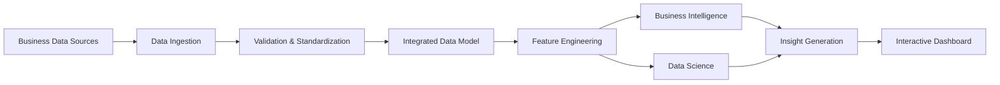
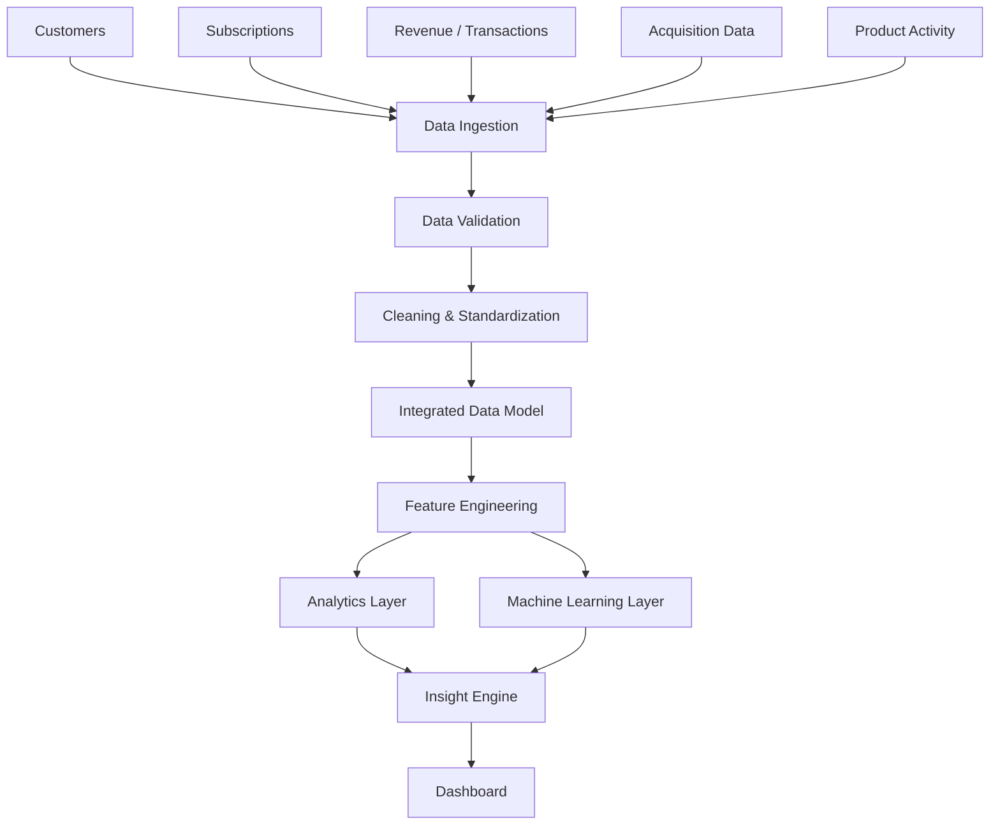
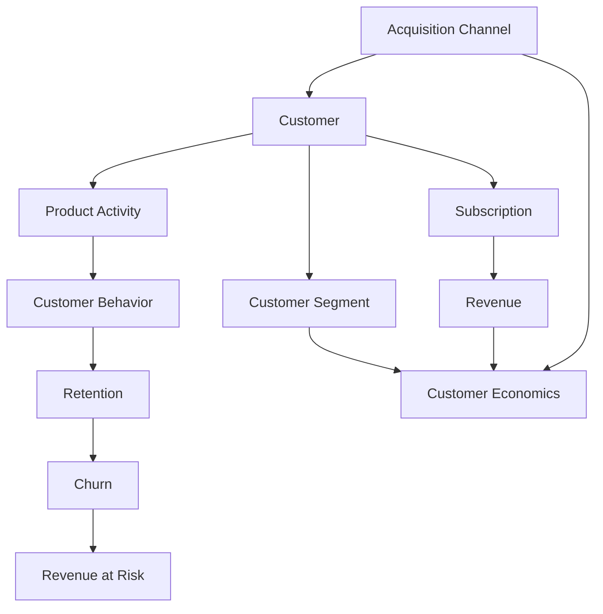

# RevLens | SaaS Revenue & Customer Dynamics

An academic portfolio project for analyzing SaaS business performance by connecting revenue, customer acquisition, retention, churn, customer behavior, and unit economics within a unified analytics workflow.

> Status: Planned / under development  
> Scope: Student project designed for a three-month development period

## Abstract

SaaS businesses generate interconnected data across customers, subscriptions, revenue, acquisition channels, product activity, and operating costs. Examining metrics such as recurring revenue, churn, customer acquisition cost, and retention independently can make it difficult to understand the relationships between customer behavior and business performance.

This project proposes a RevLens | SaaS Revenue & Customer Dynamics that integrates business data into a structured analytical workflow for revenue intelligence, customer acquisition and retention, churn analysis, customer intelligence, and unit economics. The planned system will ingest and standardize relevant datasets, construct SaaS-specific metrics and customer-level behavioral features, and provide business intelligence through an interactive analytical interface.

A data science layer is planned to extend descriptive analytics through customer segmentation, churn-risk prediction, revenue forecasting, and anomaly detection. Model outputs will be connected to business metrics so that customer-level behavior can be interpreted in terms of revenue and economic impact.

The final system is intended to function as a decision-support platform rather than a collection of independent charts. Its central objective is to connect changes in SaaS revenue with acquisition, retention, customer behavior, churn, and unit economics, and to translate these relationships into interpretable business insights.

> Quantitative model-performance results will be documented after implementation and evaluation. No results are claimed at the planning stage.

## 1. Project Overview

SaaS businesses produce data from multiple operational areas. Revenue may change because of new customers, expansion, contraction, or churn, while customer economics can vary by acquisition channel, plan, cohort, and behavioral segment.

The project therefore treats RevLens as an interconnected analytical problem rather than a set of isolated dashboards.

### Core analytical areas

1. SaaS Revenue Intelligence
2. Customer Acquisition and Retention
3. Churn Intelligence
4. Customer Intelligence
5. Unit Economics

The planned data science layer extends these areas with:

- Customer segmentation
- Churn-risk prediction
- Revenue forecasting
- Anomaly detection

## 2. Objectives

The project aims to:

- Integrate relevant SaaS business data into a consistent analytical structure.
- Standardize and validate incoming data before analysis.
- Calculate SaaS-specific business metrics.
- Analyze revenue movement and composition.
- Examine acquisition efficiency and customer retention.
- Identify historical churn patterns and customers at risk of churn.
- Develop customer-level behavioral features and segments.
- Evaluate unit economics across meaningful business dimensions.
- Connect predictive outputs to financial and customer metrics.
- Generate interpretable business insights from analytical results.
- Present the results through an interactive dashboard.

## 3. Planned Data Domains

The exact datasets and fields will be finalized during implementation. The planned analytical domains are:

| Domain | Intended analytical use |
|---|---|
| Customers | Customer profiles, cohorts, segments |
| Subscriptions | Plans, subscription state, tenure |
| Revenue / Transactions | Recurring revenue and revenue movement |
| Acquisition | Channel and customer acquisition analysis |
| Product Activity | Engagement and behavioral features |
| Business Expenses | Unit economics and contribution analysis |

The project documentation will be updated with the final schema once the data model is implemented.

## 4. System Workflow

The platform is planned as a layered analytical pipeline:



The system is intentionally organized so that data preparation, analytical logic, modelling, and presentation are separated.

## 5. Data Pipeline

The planned pipeline follows this sequence:



### Pipeline stages

#### 5.1 Data Ingestion

Collect and load the project datasets into the analytical workflow.

#### 5.2 Data Validation

Check the structure and validity of incoming data before it reaches downstream analysis.

#### 5.3 Cleaning and Standardization

Normalize fields, resolve data-quality issues, and prepare consistent records for integration.

#### 5.4 Integrated Data Model

Connect customers, subscriptions, revenue, acquisition, product activity, and other required business data through a consistent model.

#### 5.5 Feature Engineering

Create analytical variables required for SaaS metrics, customer behavior analysis, unit economics, and machine learning.

#### 5.6 Analytics Layer

Calculate business metrics and perform descriptive and diagnostic analysis.

#### 5.7 Machine Learning Layer

Apply the planned modelling techniques to appropriate engineered features.

#### 5.8 Insight Engine

Combine analytical and modelling outputs into interpretable business findings.

#### 5.9 Dashboard

Present the resulting metrics, analyses, model outputs, and insights through an interactive interface.

## 6. Analytical Model

The analytical model is designed around the relationship between customer behavior and business economics.



This model allows the project to examine questions such as:

- How does acquisition relate to customer retention?
- How does customer behavior relate to churn?
- How does churn affect recurring revenue?
- How do customer segments differ in economic value?
- How do acquisition and retention affect unit economics?

## 7. Business Intelligence Layer

### Revenue Intelligence

Planned analysis includes:

- Monthly Recurring Revenue (MRR)
- Annual Recurring Revenue (ARR)
- New revenue
- Expansion revenue
- Contraction revenue
- Churned revenue
- Revenue growth
- Revenue by plan
- Revenue by customer segment
- Revenue by acquisition channel

A central objective is to explain changes in recurring revenue rather than only display the resulting trend.

### Acquisition and Retention

Planned analysis includes:

- Customers acquired by channel
- Customer Acquisition Cost (CAC)
- Conversion analysis
- Customer cohorts
- Retention patterns
- Customer lifetime
- Acquisition-to-revenue efficiency

### Churn Intelligence

Planned analysis includes:

- Churn rate
- Churn by plan
- Churn by cohort
- Churn by acquisition channel
- Churn by customer segment
- Revenue lost through churn
- Churn-risk prediction
- Revenue at risk

### Customer Intelligence

Customer-level behavioral features are intended to include relevant measures derived from subscription, usage, revenue, and interaction data. These features will support customer segmentation and interpretation of behavioral patterns.

### Unit Economics

Planned measures include:

- Customer Acquisition Cost (CAC)
- Customer Lifetime Value (LTV)
- Average Revenue Per User (ARPU)
- Gross margin
- Contribution margin
- LTV:CAC
- Customer payback period
- Revenue per customer

Where appropriate, these measures will be analyzed by plan, customer segment, acquisition channel, region, and cohort.

## 8. Data Science and Modelling

The modelling stage is planned as an extension of the BI layer.

### 8.1 Customer Segmentation

The project will investigate customer segmentation using engineered behavioral and economic features.

Planned modelling approach:

```text
Customer Data
    ↓
Behavioral Features
    ↓
Feature Preparation
    ↓
Clustering
    ↓
Cluster Evaluation
    ↓
Cluster Interpretation
```

K-Means is planned as an initial clustering method. Other methods may be evaluated where justified by the data and project requirements.

Cluster quality will be evaluated using appropriate clustering measures and, importantly, interpretability of the resulting customer groups.

### 8.2 Churn Prediction

The planned churn workflow is:

```text
Customer History
    ↓
Behavioral & Subscription Features
    ↓
Model Training
    ↓
Churn Probability
    ↓
Customer Risk Analysis
    ↓
Revenue-at-Risk Analysis
```

The final classification model and evaluation metrics will be documented after the dataset, target definition, and modelling experiments have been finalized.

### 8.3 Revenue Forecasting

Revenue forecasting is planned as a secondary modelling component. Its purpose is to extend historical revenue analysis toward future-period estimation.

The final forecasting method and evaluation procedure will depend on the time-series structure and available observations.

### 8.4 Anomaly Detection

Anomaly detection is planned to identify unusual patterns such as:

- Revenue anomalies
- Unusual customer behavior
- Significant changes in relevant business metrics

The final detection method will be selected and evaluated during implementation.

## 9. Insight Generation

The project will include an insight layer that connects metrics and model outputs rather than presenting them independently.

The intended reasoning flow is:

```text
Metric / Model Output
        ↓
Change Identification
        ↓
Affected Segment / Dimension
        ↓
Behavioral or Business Context
        ↓
Financial Impact
        ↓
Interpretable Insight
```

Examples of the intended insight format include identifying where a revenue change occurred, which customer segment or acquisition channel was associated with the change, and how the change relates to retention or customer economics.

These examples describe the intended output format and are not claims about results currently observed in the project.

## 10. Dashboard Structure

The planned dashboard will organize the analytical outputs into focused sections:

```text
Executive Overview
├── Revenue Intelligence
├── Acquisition & Retention
├── Churn Intelligence
├── Customer Intelligence
├── Unit Economics
├── Forecasting
├── Anomaly Detection
└── Insights
```

The final dashboard structure may be adjusted according to the implemented analytical workflow.

## 11. Technology Direction

The project materials define the system primarily as an analytics and machine-learning platform. Specific production technologies will be finalized during implementation rather than being assumed in advance.

The implementation will be documented according to the tools actually used.

## 12. Project Development Procedure

Development will proceed in stages:

```text
1. Requirements & Scope
        ↓
2. Data Definition
        ↓
3. Data Ingestion
        ↓
4. Data Quality & Transformation
        ↓
5. Data Modelling
        ↓
6. Feature Engineering
        ↓
7. BI Analytics
        ↓
8. Machine Learning
        ↓
9. Insight Generation
        ↓
10. Dashboard Integration
        ↓
11. Testing & Evaluation
        ↓
12. Documentation
```

The order is intended to prevent modelling and visualization work from being built on an unstable data foundation.

## 13. Evaluation

Evaluation will be performed after implementation.

Depending on the component, evaluation will address:

- Data quality and validation outcomes
- Correctness of calculated SaaS metrics
- Customer-segmentation quality
- Churn-model performance
- Forecasting performance
- Anomaly-detection effectiveness
- Interpretability of generated customer segments and insights

No performance numbers are included in this README until they have been obtained experimentally.

## 14. Repository Structure

The repository is planned to separate data processing, modelling, application code, experiments, and tests.

```text
revlens/
├── data/
│   ├── raw/
│   ├── processed/
│   └── features/
├── notebooks/
├── src/
│   ├── ingestion/
│   ├── preprocessing/
│   ├── modeling/
│   ├── analytics/
│   └── insights/
├── app/
├── tests/
├── models/
├── configs/
├── requirements.txt
└── README.md
```

The final structure will reflect the implementation rather than treating this planned layout as completed functionality.

## 15. Project Boundaries

The project is intentionally scoped as a student portfolio and academic project.

The primary objective is to demonstrate an end-to-end analytics workflow connecting SaaS business intelligence with data science.

The project does not currently claim to provide:

- A production banking or billing system
- A full enterprise SaaS platform
- Guaranteed real-time processing
- Production-grade financial forecasting
- Production-grade automated retention actions
- Validated business recommendations before model evaluation

These capabilities may be considered future extensions if they become technically justified.

## 16. Expected Outcome

The intended outcome is a unified SaaS analytics system in which:

```text
Raw Business Data
       ↓
Reliable Data Foundation
       ↓
SaaS Metrics + Behavioral Features
       ↓
BI + Machine Learning
       ↓
Customer & Financial Analysis
       ↓
Interpretable Business Insights
```

The project will be considered complete when the planned pipeline, analytical model, modelling components, evaluation procedures, and dashboard have been implemented and documented with actual experimental results.

## 17. Future Extensions

Potential extensions include:

- Additional SaaS data sources
- More advanced customer-behavior modelling
- Expanded forecasting
- More sophisticated anomaly detection
- Automated insight delivery
- Production-oriented data infrastructure
- Additional dashboard and reporting capabilities

Future extensions will be considered only after the core analytical pipeline is stable.

## 18. Academic Positioning

This project combines concepts from:

- Data Engineering
- Business Intelligence
- Data Analytics
- Feature Engineering
- Unsupervised Learning
- Predictive Modelling
- Customer Analytics
- SaaS Metrics
- Unit Economics
- Data Visualization

Its central academic and technical focus is the integration of these components into one coherent analytical workflow rather than the implementation of an isolated machine-learning model.
